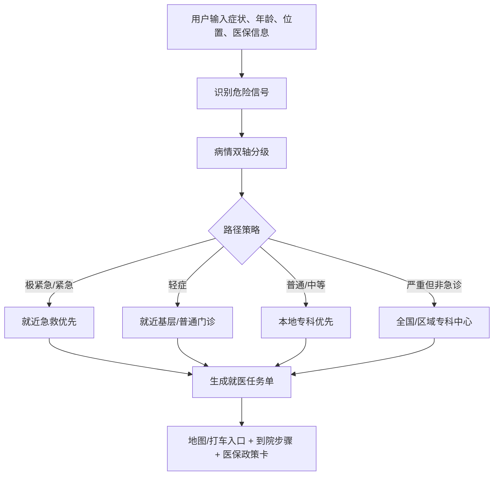

# 便医行动 MCP

> 面向患者的就医路径规划与医保信息辅助 MCP。  
> 输入症状、年龄、位置和医保情况，输出一份可执行的“就医任务单”。

| 项目项 | 内容 |
| --- | --- |
| 作品形式 | MCP 工具 / 医疗垂直 Agent 能力 |
| 面向场景 | 患者就医路径规划、急症分流、医保信息辅助 |
| 目标用户 | 普通患者、家属、老年人/儿童监护人、外地医保用户、医疗 Agent 开发者 |
| 核心输出 | 病情双轴分级、推荐科室、推荐地点、到院步骤、医保政策提示 |
| 合规边界 | 不诊断、不替代医生、不承诺疗效、不直接开药、不承诺报销金额 |

## 目录

- [1. 项目简介与医疗场景](#1-项目简介与医疗场景)
- [2. 功能特性](#2-功能特性)
- [3. 魔搭社区运行 / 部署指南](#3-魔搭社区运行--部署指南)
- [4. 演示与输入输出示例](#4-演示与输入输出示例)
- [5. 局限性与未来规划](#5-局限性与未来规划)
- [6. 团队与致谢](#6-团队与致谢)
- [合规声明](#合规声明)

---

## 1. 项目简介与医疗场景

### 一句话描述

便医行动 MCP 帮助患者把模糊的“不舒服”转化为具体的就医行动路径：**是否急诊、挂什么科、去哪儿、到院后怎么走、医保怎么问**。

### 解决的痛点

| 痛点 | 便医行动的处理方式 |
| --- | --- |
| 不知道是否需要急诊 | 根据危险信号做“紧急程度 + 严重程度”双轴分级 |
| 不知道挂什么科 | 根据症状关键词和年龄推荐科室 |
| 不知道去哪家医院 | 按病情策略选择就近急诊、基层门诊、本地专科或全国专科中心 |
| 到医院后流程不清楚 | 生成挂号、候诊、检查、缴费、取药的 To Do List |
| 医保政策看不懂 | 输出医保政策卡，提示门诊统筹、住院报销、异地备案、救助咨询 |

### 目标受众

| 用户类型 | 典型需求 |
| --- | --- |
| 普通患者和家属 | 根据症状快速获得就医路径 |
| 老年人、儿童监护人 | 获得更谨慎的急症风险提示 |
| 外地医保用户 | 了解异地备案、医保定点和结算注意事项 |
| 经济困难用户 | 优先考虑医保定点、本地结算和救助咨询路径 |
| 医疗 Agent / 小程序开发者 | 接入 MCP，生成结构化就医任务单 |

### 核心流程



---

## 2. 功能特性

### 功能总览

| 功能 | 说明 | 输出 |
| --- | --- | --- |
| 病情双轴分级 | 判断紧急程度和严重程度 | 极紧急/紧急/较急/非紧急，轻症/中等/严重/危重 |
| 科室推荐 | 根据症状和年龄推荐科室 | 急诊科、普通内科、儿科、肿瘤科等 |
| 医院/机构匹配 | 根据病情策略搜索附近或专科机构 | 推荐地点、备用地点、距离状态 |
| 就医任务单 | 生成具体行动步骤 | 挂号、候诊、检查、缴费、取药 |
| 医保政策卡 | 提示医保报销核验路径 | 门诊统筹、住院报销、异地备案、救助咨询 |
| MCP 工具化 | 可被 Agent 调用 | `get_intake_prompt`、`search_nearest_hospitals`、`generate_care_plan` |

### 病情双轴分级

| 输入线索 | 紧急程度 | 严重程度 | 路径策略 |
| --- | --- | --- | --- |
| 胸痛、呼吸困难、疑似中风、大量出血、严重过敏 | 极紧急 | 危重风险 | 就近急救优先 |
| 高热、剧烈疼痛、黑便、呕血、骨折风险 | 紧急 | 普通/中等或更高 | 有急诊能力的就近医院 |
| 头疼、发热、流鼻涕、轻微咳嗽 | 非紧急 | 轻症 | 就近基层/普通门诊 |
| 癌症、肿瘤、尿毒症等长期重大疾病 | 非紧急 | 严重 | 本地或全国专科中心 |

### MCP 工具列表

| 工具名 | 使用时机 | 主要返回 |
| --- | --- | --- |
| `get_intake_prompt` | 新对话开始时 | 用户需要填写的信息提示 |
| `search_nearest_hospitals` | 只需要搜索附近医疗机构时 | 候选医疗机构、距离、来源、搜索状态 |
| `generate_care_plan` | 需要完整患者任务单时 | `care_plan_text`、结构化数据、地图/医保/步骤 |

### 地图与距离能力

| 数据源 | 是否需要 Key | 作用 | 局限 |
| --- | --- | --- | --- |
| 高德地图 Web 服务 | 需要 | 中国大陆医院/机构搜索 | 推荐生产使用 |
| OpenStreetMap Overpass | 不需要 | 免费公共 POI 检索 | 中国大陆医疗 POI 覆盖不稳定 |
| Nominatim | 不需要 | 地址转坐标 | 小区/楼栋级地址不稳定 |
| OSRM | 不需要 | 路线距离计算 | 无实时路况 |
| 网页搜索兜底 | 不需要 | 补充候选机构来源 | 不能稳定证明最近距离 |

---

## 3. 魔搭社区运行 / 部署指南

### 魔搭信息

| 项目 | 链接 |
| --- | --- |
| 魔搭社区展示链接 | 待提交后补充：请替换为 ModelScope MCP / Studio 公开访问链接 |
| MCP 提交入口 | https://modelscope.cn/mcp/servers/create |

### 本地运行 MCP

**安装依赖**

```bash
python -m pip install -r requirements.txt
```

**配置环境变量**

不要提交真实 API Key。只提交 `.env.example`。

Windows PowerShell：

```powershell
$env:MAP_PROVIDER="auto"
$env:AMAP_API_KEY="你的高德Web服务Key"
```

Linux/macOS：

```bash
export MAP_PROVIDER=auto
export AMAP_API_KEY=你的高德Web服务Key
```

**启动 MCP**

```bash
python mcp_server.py
```

`mcp_server.py` 是 stdio MCP Server。启动后终端处于等待状态是正常现象，需要由 MCP Client、Agent 或魔搭 MCP 平台挂载调用。

### MCP 服务配置

如果魔搭社区自动解析 README 创建 MCP，请使用下面的服务配置。该配置不包含真实密钥，`AMAP_API_KEY` 如需使用请在平台环境变量中单独配置。

```json
{
  "mcpServers": {
    "bianyi-action": {
      "command": "python",
      "args": [
        "mcp_server.py"
      ],
      "env": {
        "MAP_PROVIDER": "auto",
        "WEB_SEARCH_FALLBACK": "true",
        "ROUTE_DISTANCE_PROVIDER": "osrm"
      }
    }
  }
}
```

如果平台要求填写启动命令，可填写：

```bash
python mcp_server.py
```

如果平台要求填写依赖安装命令，可填写：

```bash
python -m pip install -r requirements.txt
```

### 可选运行方式

| 方式 | 命令 | 用途 |
| --- | --- | --- |
| Gradio Demo | `python app.py` | 本地可视化演示 |
| FastAPI 接口 | `uvicorn api:app --host 0.0.0.0 --port 8000` | 小程序/H5 接口测试 |
| 分级测试 | `python triage_eval_cases.py` | 回归验证病情分级规则 |

### Agent 接入提示词

```text
你是“便医行动”就医路径规划助手。

新对话开始时，先调用 bianyi-action MCP 的 get_intake_prompt，
把 intake_prompt 展示给用户。

当用户提供症状、年龄和位置后，调用 generate_care_plan。
如果客户端提供 lat/lng，一并传入；如果没有，只传用户详细地址。

输出时原样展示 generate_care_plan 返回的 care_plan_text。
不得自行编造医院、距离、医保比例、治疗效果或药物方案。
```

---

## 4. 演示与输入输出示例

### 截图 / 视频

| 类型 | 链接 |
| --- | --- |
| 运行截图 1 | 待补充：建议提交前添加 Gradio 页面截图 |
| 运行截图 2 | 待补充：建议提交前添加 Agent 输出截图 |
| 演示视频 | 待补充：建议提交前添加视频链接 |

### 便医行动任务单

#### 输出摘要

##### 病情双轴分级

| 项目 | 内容 |
| --- | --- |
| 紧急程度 | 极紧急：建议立即拨打 120 或前往最近急诊 |
| 严重程度 | 危重风险 |
| 推荐路径策略 | 就近急救优先 |
| 判断依据 | 用户主动选择或文本识别到危险信号：呼吸困难、胸痛；老年患者风险上调；存在基础病，需要更谨慎分流；属于需要时间优先处理的急症线索，就近急救优先 |
| 建议科室 | 急诊科、心血管内科、呼吸内科 |

##### 现在要去哪里

| 项目 | 内容 |
| --- | --- |
| 推荐地点 | 郑州市金水区总医院 |
| 地址 | 郑州金水区总医院, 丰庆路, 丰庆路街道, 金水区, 郑州市, 河南省, 454003, 中国 |
| 等级/类型 | 网页搜索结果 / web_search_result |
| 推荐入口 | 网页搜索结果未验证入口，请以医院现场导诊、地图信息或医院公告为准 |
| 地图定位 | 打开地点 |
| 驾车导航 | 打开导航 |
| 打车入口 | 呼叫打车 |
| 距离 | 约 7.31 公里（基于免费 OSRM 路线服务计算的驾车路线距离；无实时路况，实际路线以地图 App 为准。） |
| 联系电话 | 网页搜索结果未验证电话，请以医院官网或地图实时信息为准 |
| 为什么推荐 | 当前策略为“就近急救优先”。用户主动选择或文本识别到危险信号：呼吸困难、胸痛；老年患者风险上调；存在基础病，需要更谨慎分流；属于需要时间优先处理的急症线索，就近急救优先 |

> 来源提醒：该地点来自网页搜索兜底，距离由免费地理编码换算为直线距离；名称、地址、营业状态、急诊能力和行车时间需以医院官网或地图 App 再次核验。

##### 备用选择

| 备用地点 | 说明 |
| --- | --- |
| 郑州市金水区总医院 - 博禾医生 | 网页搜索结果，非急诊优先 |
| 河南省人民医院实况攻略｜金水区就诊避堵指南2025 | 网页搜索结果，非急诊优先 |
| 河南郑州金水区哪个医院好-河南郑州金水区医院哪家最好-河南郑州金水区权威医院推荐/排行榜-百度健康 | 网页搜索结果，非急诊优先 |
| 郑州市中心医院 | 网页搜索结果，非急诊优先 |

##### 到院后怎么走

1. 到达 郑州市金水区总医院 后，直接前往急诊入口，不要先去普通门诊。
2. 进入急诊大厅后，先找急诊预检分诊台或分诊护士。
3. 向分诊护士说明：胸口压迫感，出汗，喘不上气；同时说明年龄、基础病、开始时间和是否正在加重。
4. 出示身份证、医保卡或电子医保码，按分诊结果进入急诊诊区。
5. 按医嘱完成生命体征测量、心电图、检验、影像或急诊处置；需要缴费时去急诊收费窗口或自助机。
6. 拿到检查结果后回到急诊诊室复诊，不要自行离院。
7. 如医生安排留观、住院、手术或转院，先向急诊护士确认办理地点和下一步流程。
8. 如医生开具处方，完成缴费后到急诊药房取药，并向药师确认用法用量。

##### 出发前准备

- 身份证
- 医保卡或电子医保码
- 手机和充电宝
- 既往病历、检查报告、影像片或电子报告
- 正在使用的药品名称、剂量和最近一次服药时间
- 过敏史记录
- 慢病诊断材料、近期复诊记录或血压/血糖记录

##### 见医生时这样说

| 项目 | 内容 |
| --- | --- |
| 主要症状 | 胸口压迫感，出汗，喘不上气 |
| 年龄/性别 | 68 / 男 |
| 持续时间 | 1小时 |
| 基础病 | 高血压 |
| 已出现的危险信号 | 呼吸困难、胸痛 |
| 希望医生帮助确认 | 是否需要急诊处理、是否需要转科、是否需要住院、是否需要专科中心进一步评估 |

##### 当地医保/报销政策卡

**政策库暂未覆盖该城市的精确报销规则**

| 项目 | 内容 |
| --- | --- |
| 适用场景 | 通用提示 |
| 政策要点 | 当前 MVP 未内置该城市已核验的起付线、报销比例、封顶线等具体规则。为避免生成错误政策，系统不编造具体比例。 |
| 报销/救助提示 | 可先按医保定点、门诊统筹、住院报销、异地备案、医疗救助五类事项准备材料。 |
| 核验状态 | 未核验：需要接入当地医保局公开政策或人工维护政策库 |

---

## 5. 局限性与未来规划

### 当前局限性

| 局限 | 说明 |
| --- | --- |
| 非诊断系统 | 分级基于可解释规则，不构成医学诊断 |
| 疾病覆盖有限 | 目前覆盖常见危险信号和部分高频症状，无法覆盖所有复杂病史 |
| 免费地图覆盖不足 | OSM/Nominatim 在中国大陆医疗 POI 和楼栋级地址上不稳定 |
| 路线距离非实时 | OSRM 无实时路况，不能替代地图 App 导航 |
| 医保信息需核验 | 政策卡为摘要，最终以医院医保系统和当地医保部门为准 |
| 隐私与数据 | 项目不接入真实患者数据，不保存患者隐私信息 |

### 未来规划

| 方向 | 计划 |
| --- | --- |
| 地图能力 | 接入高德/腾讯/百度地图正式 API，提高附近医院检索准确性 |
| 医院信息 | 接入医院官网、挂号平台或号源接口，补充科室、门诊时间和急诊能力 |
| 医保政策 | 建立可维护的城市级医保政策库，支持来源核验和定期更新 |
| 分级规则 | 扩充分级测试集，引入更多模拟边界场景 |
| 多轮追问 | 信息不足时自动追问持续时间、危险信号、基础病等关键字段 |
| 知识来源 | 增加医学知识来源标注，同时保持不诊断、不开药、不承诺疗效 |

---

## 6. 团队与致谢

### 团队成员与分工

| 成员 | 角色 | 分工 |
| --- | --- | --- |
| 待补充 | 产品与场景设计 | 患者就医流程、MVP 范围、演示案例 |
| 待补充 | 后端与 MCP 开发 | MCP Server、地图搜索、任务单生成 |
| 待补充 | 医疗规则与测试 | 分级规则、危险信号、测试案例、合规声明 |
| 待补充 | 前端与部署 | Gradio/网页 Demo、魔搭部署、演示材料 |

### 致谢

| 项目 / 平台 | 用途 |
| --- | --- |
| ModelScope 魔搭社区 | MCP / Studio / Skill 作品发布平台 |
| OpenStreetMap / Overpass | 免费公共地图数据 |
| Nominatim | 免费地理编码 |
| OSRM | 免费路线距离计算 |
| 高德地图 Web 服务 | 中国大陆地图检索推荐接入方案 |
| FastAPI | 本地 API 服务 |
| Gradio | 本地可视化 Demo |
| MCP Python SDK | MCP 工具服务能力 |

---

## 合规声明

> 本工具仅用于就医路径和医保信息辅助，不构成医学诊断、治疗建议、医院治疗效果承诺或医保报销承诺。

| 合规要求 | 项目处理 |
| --- | --- |
| 不使用真实患者数据 | 示例均为模拟输入 |
| 不硬编码敏感信息 | API Key 使用环境变量，提交 `.env.example` |
| 不做诊断承诺 | 输出为路径建议和风险提示 |
| 不直接开药 | 不给出处方、剂量、停药或换药建议 |
| 不承诺报销 | 医保信息仅提示查询路径和注意事项 |

真实医院地址、营业状态、号源、科室位置、楼层、收费和医保结算结果，请以医院、地图 App、医生和当地医保部门为准。出现胸痛、呼吸困难、意识异常、大量出血、疑似中风、严重过敏等危险信号时，应立即拨打 120 或前往最近急诊。
